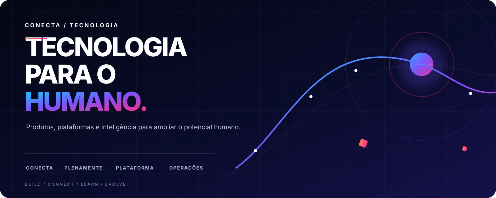
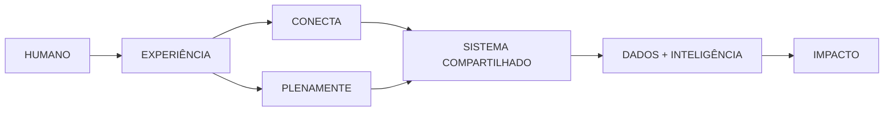

<div align="center">



**Nós não fazemos tecnologia pela tecnologia. Construímos sistemas que ajudam pessoas a aprender, se desenvolver e trabalhar melhor.**

[conectaeduc.com.br](https://conectaeduc.com.br/)  ·  [produtos e código](https://github.com/orgs/Conecta-Tec/repositories)  ·  [engineering OS](https://github.com/Conecta-Tec/engineering-hub)  ·  [segurança](../SECURITY.md)

</div>

---

## 01 / O sistema

| | Universo | Construímos para… |
|---:|---|---|
| `01` | **Conecta** | transformar educação socioemocional em experiências digitais para escolas, educadores, estudantes e famílias. |
| `02` | **PlenaMente** | criar jornadas contínuas de desenvolvimento humano e socioemocional. |
| `03` | **Plataforma** | conectar identidade, dados, componentes, integrações e infraestrutura em uma base compartilhada. |
| `04` | **Operações** | automatizar o trabalho interno e liberar tempo para decisões de maior impacto. |



## 02 / Interface do time

> **Engineering OS** é a porta de entrada privada para tudo que envolve tecnologia: novos projetos, acessos, suporte, incidentes, decisões, catálogo e operação.

| Ação | Entrada |
|---|---|
| Iniciar um produto, serviço ou automação | **[NEW / REPOSITORY →](https://github.com/Conecta-Tec/engineering-hub/issues/new?template=new_repository.yml)** |
| Conceder, revisar ou remover acesso | **[ACCESS / REQUEST →](https://github.com/Conecta-Tec/engineering-hub/issues/new?template=access_request.yml)** |
| Resolver uma necessidade técnica | **[TECH / SUPPORT →](https://github.com/Conecta-Tec/engineering-hub/issues/new?template=technical_request.yml)** |
| Responder a indisponibilidade ou risco | **[INCIDENT / RESPONSE →](https://github.com/Conecta-Tec/engineering-hub/issues/new?template=incident.yml)** |
| Registrar arquitetura, padrão ou trade-off | **[DECISION / RECORD →](https://github.com/Conecta-Tec/engineering-hub/issues/new?template=technical_decision.yml)** |

<sub>O Engineering OS e seus atalhos são visíveis apenas para integrantes autorizados.</sub>

## 03 / Como construímos

```text
PROBLEMA → HIPÓTESE → EXPERIÊNCIA → SOFTWARE → SINAL → APRENDIZADO
```

- **Humano primeiro** — experiência, clareza e acessibilidade são arquitetura.
- **Impacto observável** — cada entrega precisa produzir um sinal que permita aprender.
- **Pequeno, componível e reversível** — reduzimos risco sem reduzir ambição.
- **Seguro desde o início** — privacidade, menor privilégio e proteção de segredos por padrão.
- **Decisões que sobrevivem ao chat** — contexto, responsáveis e trade-offs ficam registrados.

## 04 / O protocolo

| Build | Decide | Operate |
|---|---|---|
| [Princípios](../docs/ENGINEERING_PRINCIPLES.md) | [Governança](../GOVERNANCE.md) | [Segurança](../SECURITY.md) |
| [Padrões de repositório](../docs/REPOSITORY_STANDARDS.md) | [Registro de decisão](../docs/DECISION_TEMPLATE.md) | [Suporte](../SUPPORT.md) |
| [Como contribuir](../CONTRIBUTING.md) | [Código de conduta](../CODE_OF_CONDUCT.md) | [Workflows oficiais](../workflow-templates) |

---

<div align="center">

**CONECTAR → APRENDER → EVOLUIR**

Conecta Educação Socioemocional · São Paulo, Brasil

</div>
