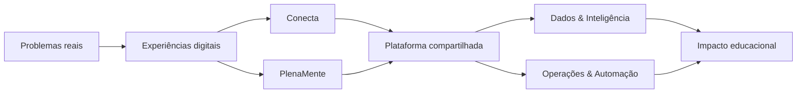

 

# Tecnologia que conecta pessoas, aprendizagem e futuro.

**Construímos o ecossistema digital da Conecta Educação Socioemocional:** produtos Conecta e PlenaMente, plataformas compartilhadas, dados, automações e sistemas internos.

---

## Comece por aqui

<table>
<tr>
<td width="25%" valign="top">

### 🧭 Explorar

Encontre produtos, serviços, bibliotecas e automações do ecossistema.

**[Ver repositórios →](https://github.com/orgs/Conecta-Tec/repositories)**

</td>
<td width="25%" valign="top">

### ⚡ Criar

Abra um novo projeto já alinhado aos padrões do time.

**[Solicitar repositório →](https://github.com/Conecta-Tec/engineering-hub/issues/new?template=new_repository.yml)**

</td>
<td width="25%" valign="top">

### 🛟 Operar

Peça suporte, registre incidentes e encontre runbooks.

**[Abrir central →](https://github.com/Conecta-Tec/engineering-hub)**

</td>
<td width="25%" valign="top">

### 🛡️ Proteger

Consulte políticas, responsáveis e práticas de segurança.

**[Ver segurança →](https://github.com/Conecta-Tec/.github/blob/main/SECURITY.md)**

</td>
</tr>
</table>

> 🔒 A central operacional é privada e aparece apenas para integrantes autorizados da organização.

## Um ecossistema, quatro frentes

| Frente | O que construímos | Resultado que buscamos |
|---|---|---|
| 🟣 **Conecta** | Experiências digitais para escolas, educadores, estudantes e famílias | Tornar a educação socioemocional presente, acessível e mensurável |
| 🟠 **PlenaMente** | Jornadas e ferramentas de desenvolvimento socioemocional | Apoiar o desenvolvimento humano de forma contínua |
| 🔵 **Plataforma** | Identidade, integrações, dados, componentes e infraestrutura | Ganhar escala sem fragmentar tecnologia e experiência |
| 🟢 **Operações** | Sistemas internos, inteligência e automações | Liberar o time para trabalhos de maior impacto |

## Engenharia com propósito e disciplina

- **Impacto antes de complexidade.** A menor solução capaz de resolver bem o problema.
- **Experiência humana por padrão.** Clareza, acessibilidade e respeito em cada interação.
- **Qualidade verificável.** Pull request, testes, CI, observabilidade e rollback fazem parte da entrega.
- **Segurança desde a concepção.** Dados, acessos e segredos recebem proteção antes da produção.
- **Conhecimento que permanece.** Decisões, responsáveis e operação ficam documentados.

## Playbook do time

<table>
<tr>
<td width="33%" valign="top">

### 01 · Construir

- [Princípios de engenharia](../docs/ENGINEERING_PRINCIPLES.md)
- [Padrões de repositório](../docs/REPOSITORY_STANDARDS.md)
- [Como contribuir](../CONTRIBUTING.md)

</td>
<td width="33%" valign="top">

### 02 · Decidir

- [Governança](../GOVERNANCE.md)
- [Registrar uma decisão](../docs/DECISION_TEMPLATE.md)
- [Código de conduta](../CODE_OF_CONDUCT.md)

</td>
<td width="33%" valign="top">

### 03 · Operar

- [Política de segurança](../SECURITY.md)
- [Suporte](../SUPPORT.md)
- [Workflows oficiais](../workflow-templates)

</td>
</tr>
</table>

## Ações rápidas do time

| Preciso… | Atalho |
|---|---|
| Criar produto, serviço ou automação | [Solicitar novo repositório](https://github.com/Conecta-Tec/engineering-hub/issues/new?template=new_repository.yml) |
| Conceder, revisar ou remover acesso | [Solicitar acesso](https://github.com/Conecta-Tec/engineering-hub/issues/new?template=access_request.yml) |
| Resolver uma necessidade técnica | [Abrir atendimento](https://github.com/Conecta-Tec/engineering-hub/issues/new?template=technical_request.yml) |
| Responder a indisponibilidade ou risco | [Registrar incidente](https://github.com/Conecta-Tec/engineering-hub/issues/new?template=incident.yml) |
| Registrar arquitetura ou padrão | [Propor decisão técnica](https://github.com/Conecta-Tec/engineering-hub/issues/new?template=technical_decision.yml) |
| Encontrar responsáveis | [Ver times](https://github.com/orgs/Conecta-Tec/teams) |

---

### Conectar emoções, criatividade, aprendizagem e tecnologia.

[conectaeduc.com.br](https://conectaeduc.com.br/) · [Engineering Hub](https://github.com/Conecta-Tec/engineering-hub) · [Segurança](../SECURITY.md) · [Governança](../GOVERNANCE.md)

