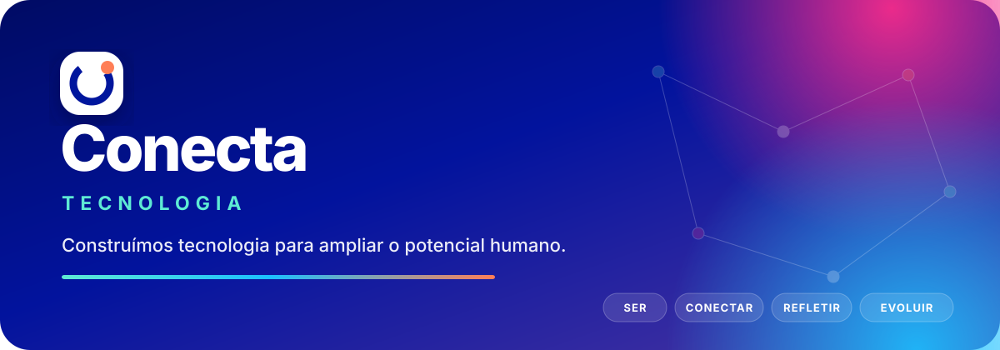

### Educação, ciência e tecnologia para ampliar o potencial humano.

## Tecnologia que conecta para transformar

Somos o núcleo de tecnologia da **Conecta Educação Socioemocional**. Construímos produtos digitais, plataformas e sistemas internos que aproximam escolas, educadores, estudantes e famílias de experiências de aprendizagem mais humanas, criativas e orientadas por evidências.

Nosso trabalho une engenharia de software, educação socioemocional e inovação pedagógica para transformar boas ideias em experiências simples, seguras e escaláveis.

## Nosso ecossistema

| Frente | O que construímos |
|---|---|
| **Conecta** | Produtos e serviços digitais que sustentam a experiência educacional da Conecta. |
| **PlenaMente** | Tecnologia do ecossistema Conecta dedicada ao desenvolvimento socioemocional. |
| **Plataforma** | Componentes, integrações, dados, identidade e infraestrutura compartilhada. |
| **Operações internas** | Automações e sistemas que tornam o trabalho do time mais simples e confiável. |

## Como construímos

- 🔐 **Segurança e privacidade desde o início** — acesso mínimo, proteção de segredos e cuidado com dados pessoais.
- 🧭 **Impacto antes de complexidade** — tecnologia existe para resolver problemas reais de pessoas reais.
- 🧩 **Plataforma quando faz sentido** — compartilhamos capacidades sem criar abstrações prematuras.
- ✅ **Qualidade verificável** — revisão, testes, automação e observabilidade fazem parte da entrega.
- 📚 **Conhecimento que permanece** — decisões importantes ficam documentadas e acessíveis ao time.
- ♿ **Experiências inclusivas** — acessibilidade e clareza são requisitos, não acabamento.

## Começando por aqui

<table>
<tr>
<td width="33%" valign="top">

### Para contribuir

Leia o [guia de contribuição](../CONTRIBUTING.md), escolha uma issue e mantenha o pull request pequeno, testável e bem explicado.

</td>
<td width="33%" valign="top">

### Para criar um projeto

Siga os [padrões de repositório](../docs/REPOSITORY_STANDARDS.md) e comece com um dos nossos workflows oficiais.

</td>
<td width="33%" valign="top">

### Para decisões técnicas

Use o [template de decisão](../docs/DECISION_TEMPLATE.md) e registre contexto, alternativas e consequências.

</td>
</tr>
</table>

## Guardrails da organização

- Repositórios de produto e sistemas internos são **privados por padrão**.
- Acesso é concedido por times; não existe permissão-base automática.
- Todos os membros usam **2FA com métodos seguros**.
- Secret scanning, push protection, CodeQL e Dependabot fazem parte do padrão.
- Credenciais, dados pessoais e informações de escolas jamais entram no código ou nas issues.
- Mudanças chegam à branch principal por pull request com revisão e CI.

---

**Conecta Educação Socioemocional** · conectar emoções, criatividade e aprendizagem.

[Conheça a Conecta](https://conectaeduc.com.br/) · [Política de segurança](../SECURITY.md) · [Suporte](../SUPPORT.md)

